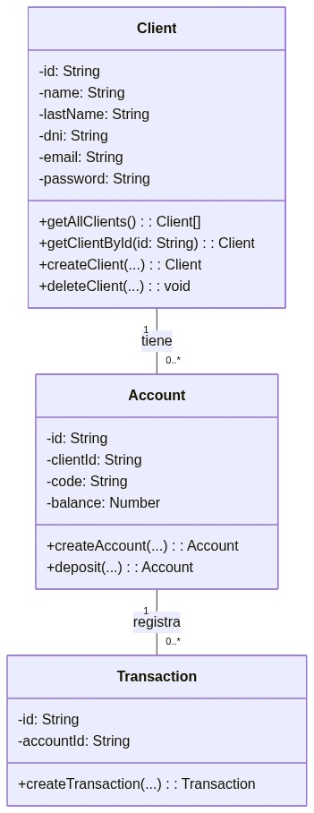
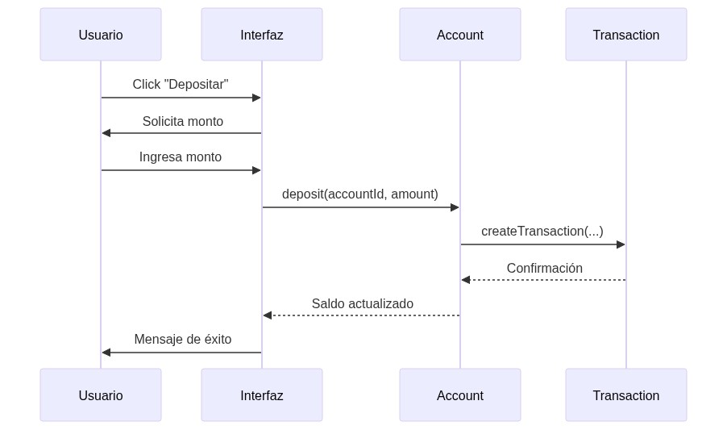
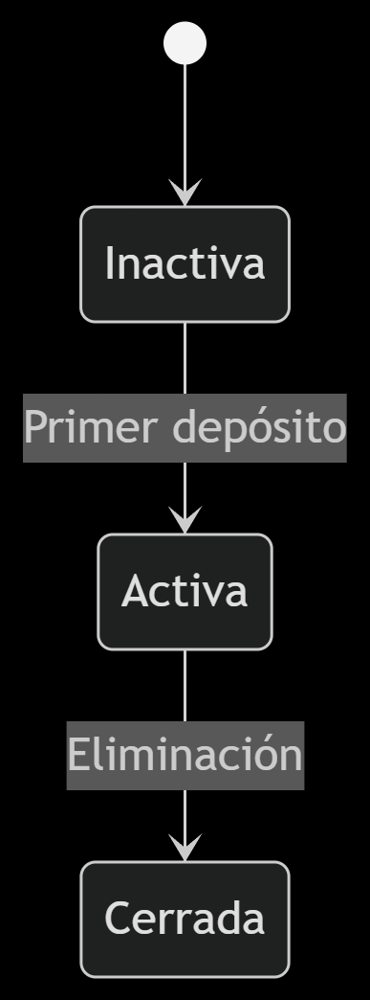

# 💼 Sistema FinTech - Gestión Bancaria

Versión 1.0  
Documentación del sistema de gestión bancaria desarrollado como plataforma FinTech.

---

## 📋 Índice

1. [Introducción](#1-introducción)  
2. [Funcionalidades Clave](#2-funcionalidades-clave)  
3. [Diagramas UML](#3-diagramas-uml)  
   - [Diagrama de Clases](#31-diagrama-de-clases)  
   - [Diagrama de Secuencia](#32-diagrama-de-secuencia-depósito)  
   - [Diagrama de Estados](#33-diagrama-de-estados-cuenta)  
4. [Principios SOLID Aplicados](#4-principios-solid-aplicados)  
5. [Patrones de Diseño](#5-patrones-de-diseño)  
6. [Explicación Técnica](#6-explicación-técnica)

---

## 1. Introducción

El sistema **FinTech** es una plataforma bancaria que permite:

- Gestión de clientes (registro, autenticación, CRUD).
- Creación de cuentas con saldo inicial.
- Realización de transacciones (depósitos y retiros).
- Consulta de saldo e historial de movimientos.

### 🛠️ Tecnologías Utilizadas

- **Frontend:** HTML5, CSS, JavaScript (POO)
- **Persistencia:** `localStorage` (simula una base de datos)

---

## 2. Funcionalidades Clave

| Módulo        | Funcionalidades |
|---------------|-----------------|
| **Clientes**      | Registro, login, edición de perfil, eliminación de cuenta |
| **Cuentas**       | Creación, asociación a cliente, depósitos, retiros, consulta de saldo |
| **Transacciones** | Registro automático de movimientos, historial por cuenta/cliente |
| **Administración**| Vista privilegiada para admins (clientes, cuentas, transacciones) |

---

## 3. Diagramas UML

### 3.1 Diagrama de Clases

Relación:  
- 1 Cliente -> 0..* Cuentas  
- 1 Cuenta -> 0..* Transacciones



---

### 3.2 Diagrama de Secuencia (Depósito)

Flujo:
- Usuario realiza un depósito
- Se crea una transacción
- Se actualiza el saldo y se muestra mensaje de éxito



---

### 3.3 Diagrama de Estados (Cuenta)

Posibles estados de una cuenta:
- Inactiva
- Activa
- Cerrada



---

## 4. Principios SOLID Aplicados

| Principio              | Aplicación en el Sistema |
|------------------------|--------------------------|
| **S: Single Responsibility**   | Cada clase tiene una única responsabilidad (`Auth`, `Client`, etc.) |
| **O: Open/Closed**             | Las clases se extienden sin modificar el código base |
| **L: Liskov Substitution**     | Posibilidad de heredar `Account` sin romper funcionalidad |
| **I: Interface Segregation**   | Módulos independientes por responsabilidad |
| **D: Dependency Inversion**    | `localStorage` como dependencia intercambiable |

---

## 5. Patrones de Diseño

| Patrón        | Uso en el Sistema |
|---------------|------------------|
| **Singleton**     | `Auth` gestiona una única sesión activa |
| **Factory Method**| `Client.createClient()`, `Account.createAccount()` |
| **Observer**      | La UI reacciona a cambios del modelo (actualización de saldo) |

---

## 6. Explicación Técnica

### 6.1 Persistencia

Se usa `localStorage` como almacenamiento:

```js
// Ejemplo: Guardar clientes
localStorage.setItem('clients', JSON.stringify(clients));
```

### 6.2 Seguridad

- Validación de DNI y email únicos.
- Control de saldo no negativo al retirar.

### 6.3 Frontend

- Interfaz responsive en HTML/CSS con pestañas.
- JavaScript orientado a objetos.
- Uso de `eventListeners` para manejar las acciones del usuario.

---
 
© 2025 - Sistema FinTech
